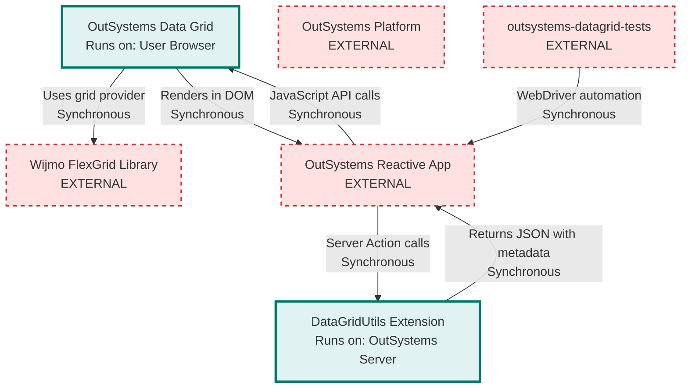

# OutSystems Data Grid Architecture

> **Repository:** outsystems-datagrid
> **Runtime Environment:** User Browser (TypeScript/JavaScript) + OutSystems Server (.NET Extension)
> **Last Updated:** 2026-03-04

## Overview

OutSystems Data Grid wraps the Wijmo FlexGrid library to deliver enterprise-grade spreadsheet functionality within OutSystems Reactive Web applications. The repository contains a TypeScript library that runs in the browser and a .NET extension that executes server-side to prepare OutSystems entity data for grid consumption.

## Architecture Diagram

## External Integrations

| External Service          | Communication Type    | Purpose                                                                                                                                                       |
| ------------------------- | --------------------- | ------------------------------------------------------------------------------------------------------------------------------------------------------------- |
| Wijmo FlexGrid Library    | Sync (JavaScript API) | Third-party grid provider offering data virtualization, editing, filtering, sorting, grouping, export, and spreadsheet features via multi-panel architecture  |
| OutSystems Platform       | Sync (Runtime APIs)   | Host platform executing server-side extensions and client-side blocks                                                                                         |
| OutSystems Reactive App   | Sync (JavaScript API) | Consumer application instantiating and controlling grid instances via public API                                                                              |
| outsystems-datagrid-tests | Sync (WebDriver HTTP) | External test automation repository validating grid behavior across browsers (Chrome, Firefox, Edge, Safari) and environments using WebdriverIO with Cucumber |

## Architectural Tenets

### T1. Provider Abstraction Through Interfaces

The framework defines all grid behavior through abstract interfaces and classes in the `OSFramework` namespace, completely isolating OutSystems-specific logic from provider implementation details. Wijmo-specific code resides exclusively in the `Providers` namespace and implements these contracts.

**Rationale:** This abstraction enables swapping grid providers without modifying the OutSystems API surface or core grid logic. The framework layer remains stable while provider implementations can evolve independently.

**Evidence:**

- `src/OSFramework/DataGrid/Grid/IGrid.ts` - defines grid contract without provider knowledge
- `src/OSFramework/DataGrid/Column/AbstractColumn.ts` - base column behavior independent of provider
- `src/Providers/DataGrid/Wijmo/Grid/FlexGrid.ts` (in `FlexGrid` class) - implements `AbstractGrid` with Wijmo provider
- `src/Providers/DataGrid/Wijmo/Grid/Factory.ts` (in `GridFactory.MakeGrid` function) - provider factory creates concrete implementations

### T2. Namespace-Based Layer Enforcement

TypeScript namespaces (`OSFramework`, `Providers`, `OutSystems`) compile to a single AMD module without import statements. Layer boundaries are enforced by architectural convention: `OSFramework` must not reference `Providers` directly, and `Providers` implements `OSFramework` interfaces.

**Rationale:** Namespace-based architecture with single-file compilation prevents circular dependencies and enforces unidirectional data flow. The API layer orchestrates, the framework defines contracts, and providers implement specifics.

**Evidence:**

- `tsconfig.json` - compiles all TypeScript to single AMD module `dist/GridFramework.js` via `outFile` option
- `src/OSFramework/` directory - all 146 files declare `namespace OSFramework`, no references to `Providers` namespace found
- `src/Providers/` directory - all 59 files declare `namespace Providers` and reference `OSFramework.DataGrid` interfaces
- `src/OutSystems/GridAPI/GridManager.ts` (in `CreateGrid` function) - API layer calls through factory: `Providers.DataGrid.Wijmo.Grid.GridFactory.MakeGrid`

### T3. Feature Composition Over Inheritance

Grid capabilities (export, pagination, filtering, sorting, sanitization) are implemented as composable feature objects that each grid instance aggregates, rather than extending grid classes with feature methods.

**Rationale:** Composition provides flexibility to enable/disable features dynamically and test features in isolation. Each feature encapsulates its own state and Wijmo event handlers without polluting the grid class.

**Evidence:**

- `src/OSFramework/DataGrid/Feature/` directory - contains interface definitions for all feature contracts (32 feature interface files)
- `src/OSFramework/DataGrid/Feature/ExposedFeatures.ts` (in `ExposedFeatures` class) - aggregates 27 feature properties into single composable object
- `src/Providers/DataGrid/Wijmo/Features/` directory - contains Wijmo-specific implementations of all features (32 implementation files)
- `src/Providers/DataGrid/Wijmo/Features/FeatureBuilder.ts` (in `AbstractFactoryBuilder` class) - constructs feature instances via factory pattern
- `src/OSFramework/DataGrid/Grid/AbstractGrid.ts` (in `AbstractGrid` class) - grid contains `_features` property of type `Feature.ExposedFeatures`

### T4. Data Transformation at Server Boundary

Complex data preparation (OutSystems entity records to JSON with metadata extraction) occurs server-side via .NET extension before reaching the browser, keeping client-side code focused on presentation logic.

**Rationale:** Server-side transformation leverages OutSystems runtime metadata and type information unavailable in the browser. This separation reduces client bundle size and computational load while ensuring type-safe data handling.

**Evidence:**

- `extension/DataGridUtils/Source/NET/DataGridUtils.cs` (in `MssConvertData2JSON` action) - converts OutSystems objects to JSON with embedded metadata
- `extension/DataGridUtils/Source/NET/ObtainMetadata.cs` (in `getDataMetadata` method) - extracts column types and structure from .NET reflection
- `src/OSFramework/DataGrid/Grid/AbstractDataSource.ts` - client-side only handles data binding and transformation
- `src/OutSystems/GridAPI/GridManager.ts` (in `setDataInGrid` function) - receives pre-formatted JSON string from server

### T5. Security Through Sanitization Layers

Input sanitization occurs at two distinct boundaries: when data enters the grid from OutSystems (HTML escaping), and when data exits to clipboard/CSV export (formula injection prevention). The export sanitizer can be dynamically enabled or disabled at runtime.

**Rationale:** Defense-in-depth through multiple sanitization layers protects against distinct attack vectors (XSS via rendering, CSV injection via export) without coupling concerns. Each sanitization layer addresses specific threat models at appropriate system boundaries.

**Evidence:**

- `src/OSFramework/DataGrid/Helper/Sanitize.ts` (in `Sanitize` function) - escapes HTML angle brackets to prevent XSS when rendering user data
- `src/OutSystems/GridAPI/GridManager.ts` (in `setDataInGrid` function) - conditionally sanitizes incoming data if `grid.config.sanitizeInputValues` is enabled
- `src/Providers/DataGrid/Wijmo/Features/CellDataSanitizer.ts` (in `escapeCsvInjection` method) - neutralizes formula characters during clipboard/export operations
- `src/OSFramework/DataGrid/Feature/ICellDataSanitizer.ts` - defines feature interface with `enableCellDataSanitizer` and `disableCellDataSanitizer` methods

## Component Boundaries

### Browser Runtime (TypeScript)

**OutSystems API Layer** (`src/OutSystems/GridAPI/`)
Exposes public JavaScript API consumed by OutSystems Reactive applications. Handles grid lifecycle, event subscriptions, and coordinates operations across framework and provider layers.

**Framework Layer** (`src/OSFramework/DataGrid/`)
Provider-agnostic abstractions defining grid contracts, column types, events, features, and data source interfaces. Contains business logic independent of any specific grid library.

**Provider Layer** (`src/Providers/DataGrid/Wijmo/`)
Wijmo-specific implementations of framework interfaces. Directly interacts with `wijmo.grid.FlexGrid` library and translates between framework abstractions and Wijmo APIs. Leverages Wijmo's multi-panel architecture (data cells, column headers, row headers, footers) and row/column virtualization for performance with large datasets.

### Server Runtime (.NET)

**DataGridUtils Extension** (`extension/DataGridUtils/`)
OutSystems Integration Studio extension that converts OutSystems entity records and structures to JSON format with embedded metadata. Runs in OutSystems application server process.

## Build Process

The TypeScript codebase compiles to a single AMD module (`dist/GridFramework.js`) that OutSystems applications load as a script resource. The .NET extension compiles to a DLL and deploys with OutSystems platform.

**Common commands:**

- `npm run build` - compile TypeScript, lint, and generate production artifacts
- `npm run dev` - start development mode with live browser-sync on port 3000
- `npm run setup` - install dependencies and start development mode

See `gulpfile.js` for complete build orchestration.
