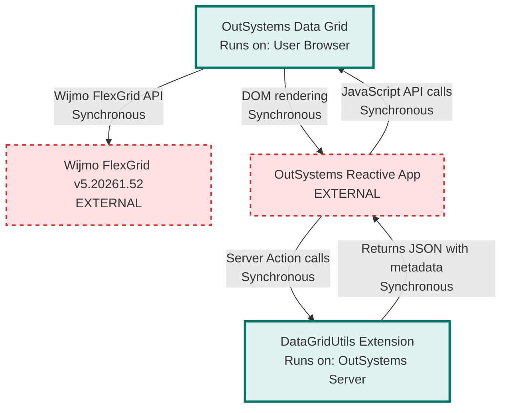

# OutSystems Data Grid Architecture

> **Repository:** outsystems-datagrid
> **Runtime Environment:** User Browser (TypeScript/JavaScript) + OutSystems Server (.NET Extension)
> **Last Updated:** 2026-08-25

## Overview

OutSystems Data Grid wraps the Wijmo FlexGrid library to deliver enterprise-grade spreadsheet functionality within OutSystems Reactive Web applications. The repository contains a TypeScript library that runs in the browser and a .NET extension that executes server-side to prepare OutSystems entity data for grid consumption.

## Architecture Diagram

## External Integrations

| External Service | Communication Type | Purpose |
|---|---|---|
| Wijmo FlexGrid v5.20261.52 | Sync (JavaScript API) | Third-party grid provider offering data virtualization, editing, filtering, sorting, grouping, export, and multi-panel architecture |
| OutSystems Reactive App | Sync (JavaScript API) | Consumer application instantiating and controlling grid instances via the `OutSystems.GridAPI` public API |
| OutSystems Platform | Sync (Server Actions) | Host platform executing the .NET extension server-side and loading the compiled JS module client-side |
| outsystems-datagrid-tests | Sync (WebDriver HTTP) | External test repository validating grid behavior across browsers via WebdriverIO + Cucumber |

## Architectural Tenets

### T1. Provider Abstraction Through Interfaces

The framework defines all grid behavior through abstract interfaces and classes in the `OSFramework` namespace, completely isolating OutSystems-specific logic from provider implementation details. Wijmo-specific code resides exclusively in the `Providers` namespace and implements these contracts. This abstraction enables swapping grid providers without modifying the OutSystems API surface or core grid logic.

**Evidence:**
- `src/OSFramework/DataGrid/Grid/IGrid.ts` - defines grid contract without provider knowledge
- `src/OSFramework/DataGrid/Column/AbstractColumn.ts` - base column behavior independent of provider
- `src/Providers/DataGrid/Wijmo/Grid/FlexGrid.ts` (in `FlexGrid` class) - implements `AbstractGrid` with Wijmo provider
- `src/Providers/DataGrid/Wijmo/Grid/Factory.ts` (in `GridFactory.MakeGrid`) - provider factory creates concrete implementations
- `src/OSFramework/` - zero references to `Providers` namespace across all 147 files, confirming one-way dependency

### T2. Namespace-Based Layer Enforcement

TypeScript namespaces (`OSFramework`, `Providers`, `OutSystems`) compile to a single AMD module without ES6 import statements. Layer boundaries are enforced by architectural convention: `OSFramework` must not reference `Providers` directly, `Providers` implements `OSFramework` interfaces, and `OutSystems.GridAPI` orchestrates both layers through factories.

**Rationale:** Namespace-based architecture with single-file compilation prevents circular dependencies and enforces unidirectional data flow. The API layer orchestrates, the framework defines contracts, and providers implement specifics.

**Evidence:**
- `tsconfig.json` - compiles all TypeScript to single AMD module `dist/GridFramework.js` via `outFile` option
- `src/OSFramework/` - all 147 files declare `namespace OSFramework`, no references to `Providers` namespace
- `src/Providers/` - all 59 files declare `namespace Providers` and reference `OSFramework.DataGrid` interfaces
- `src/OutSystems/GridAPI/GridManager.ts` (in `CreateGrid`) - API layer delegates to `Providers.DataGrid.Wijmo.Grid.GridFactory.MakeGrid`

### T3. Feature Composition Over Inheritance

Grid capabilities (export, pagination, filtering, sorting, sanitization, etc.) are implemented as composable feature objects that each grid instance aggregates, rather than extending grid classes with feature methods. The `ExposedFeatures` class aggregates 31 feature properties, and the `FeatureBuilder` constructs all features via a fluent builder pattern.

**Rationale:** Composition provides flexibility to enable/disable features dynamically and test features in isolation. Each feature encapsulates its own state and Wijmo event handlers without polluting the grid class.

**Evidence:**
- `src/OSFramework/DataGrid/Feature/ExposedFeatures.ts` (in `ExposedFeatures` class) - aggregates 31 feature properties into single composable object
- `src/OSFramework/DataGrid/Feature/` - contains 31 feature interface definitions (`ICalculatedField`, `ICellData`, `IExport`, etc.)
- `src/Providers/DataGrid/Wijmo/Features/FeatureBuilder.ts` (in `FeatureBuilder` class) - fluent builder constructs all feature instances via `_make*` methods
- `src/OSFramework/DataGrid/Grid/AbstractGrid.ts` (in `AbstractGrid` class) - grid holds `_features` property of type `Feature.ExposedFeatures`

### T4. Data Transformation at Server Boundary

Complex data preparation (OutSystems entity records to JSON with metadata extraction) occurs server-side via .NET extension before reaching the browser, keeping client-side code focused on presentation logic.

**Rationale:** Server-side transformation leverages OutSystems runtime metadata and type information unavailable in the browser. This separation reduces client computational load and ensures type-safe data handling with proper date formatting and field-type metadata.

**Evidence:**
- `extension/DataGridUtils/Source/NET/DataGridUtils.cs` (in `MssConvertData2JSON`) - converts OutSystems objects to JSON with embedded metadata
- `extension/DataGridUtils/Source/NET/ObtainMetadata.cs` (in `getDataMetadata`) - extracts column types and structure from .NET reflection
- `extension/DataGridUtils/Source/NET/temp_ardoJSON.cs` - forked JSON serializer handling OutSystems-specific date conventions
- `src/OutSystems/GridAPI/GridManager.ts` (in `setDataInGrid`) - receives pre-formatted JSON string from server

### T5. Security Through Sanitization Layers

Input sanitization occurs at two distinct boundaries: when data enters the grid from OutSystems (HTML escaping), and when data exits to clipboard/CSV export (formula injection prevention). The export sanitizer can be dynamically enabled or disabled at runtime via the public API.

**Rationale:** Defense-in-depth through multiple sanitization layers protects against distinct attack vectors (XSS via rendering, CSV injection via export) without coupling concerns. Each sanitization layer addresses specific threat models at appropriate system boundaries.

**Evidence:**
- `src/OSFramework/DataGrid/Helper/Sanitize.ts` (in `Sanitize` function) - replaces angle brackets with look-alike characters to prevent XSS when rendering user data
- `src/OutSystems/GridAPI/GridManager.ts` (in `setDataInGrid`) - conditionally sanitizes incoming data when `grid.config.sanitizeInputValues` is enabled
- `src/Providers/DataGrid/Wijmo/Features/CellDataSanitizer.ts` (in `escapeCsvInjection`) - neutralizes formula characters during clipboard/export operations
- `src/OutSystems/GridAPI/Security.ts` (in `EnableCellDataSanitizer`/`DisableCellDataSanitizer`) - runtime toggle for CSV injection protection

## Component Boundaries

### Browser Runtime (TypeScript)

**OutSystems API Layer** (`src/OutSystems/GridAPI/`)
Exposes public JavaScript API consumed by OutSystems Reactive applications. Handles grid lifecycle, event subscriptions, and coordinates operations across framework and provider layers. Includes performance instrumentation (`Performance/` subdirectory) wrapping all public API calls with timing marks.

**Framework Layer** (`src/OSFramework/DataGrid/`)
Provider-agnostic abstractions defining grid contracts, column types, events, features, and data source interfaces. Contains business logic independent of any specific grid library.

**Provider Layer** (`src/Providers/DataGrid/Wijmo/`)
Wijmo-specific implementations of framework interfaces. Directly interacts with `wijmo.grid.FlexGrid` library and translates between framework abstractions and Wijmo APIs. Leverages Wijmo's multi-panel architecture and row/column virtualization for performance with large datasets.

### Server Runtime (.NET)

**DataGridUtils Extension** (`extension/DataGridUtils/Source/NET/`)
OutSystems Integration Studio extension that converts OutSystems entity records and structures to JSON format with embedded metadata. Runs in OutSystems application server process. See `docs/adr/` for .NET upgrade decisions (ADR-0001) and Wijmo upgrade decisions (ADR-0002).

## Build Process

The TypeScript codebase compiles to a single AMD module (`dist/GridFramework.js`) that OutSystems applications load as a script resource. The .NET extension compiles to a DLL and deploys with OutSystems platform.

Run `npm run build` for production artifacts or `npm run dev` for browser-sync on port 3000. See `gulpfile.js` and `gulp/Tasks/` for build orchestration details.
